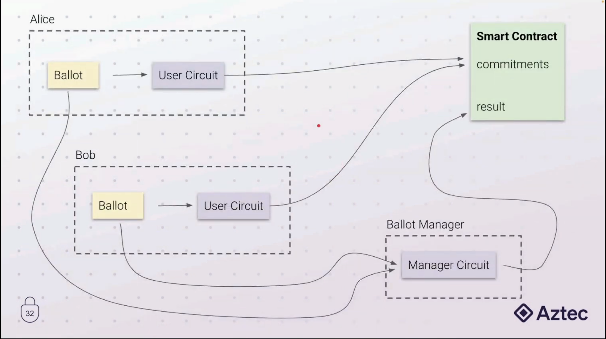

# Quadratic Voting using zk proofs [WIP]

This repo shows a [quadratic voting](https://www.economist.com/interactive/2021/12/18/quadratic-voting) application that leverages zk proofs to keep users votes secret, while making sure each one is counted in the final result.
The votes of each user are kept secret to everyone, except a trusted ballot manager that is in charge of counting the votes, but cannot censor or modify user's choices.  
Here's an architecture diagram of the solution:



## Circuits

### Cast Ballot (user circuit)

-   Enforces Quadratic Voting rules
-   Outputs a comittment for the user to share publicly and can be verified

### Count Votes(manager circuit)

-   Enforces that all committed votes are counted
-   Outputs the vote total for each candidate

## DSLs

The application is written in the following DSLs to show the differences:

-   [Noir](https://github.com/noir-lang/noir) :white_check_mark:
-   [Zokrates](https://github.com/Zokrates/ZoKrates): TODO

The repo is based on [ZK HACK III Workshop - Noir](https://www.youtube.com/watch?v=5CziMfChveY)

## Usage

### Noir

1. First build both circuits using nargo build

    ```
    nargo build
    ```

2. To simulate votes from Alice and Bob you need to run the prover twice. There are 2 examples in the Prover.toml that you can use and comment/uncomment each input as needed. Inside the cast-ballot folder, run the following command for each voter:
    ```
    nargo prove p
    ```
3. If you want to verify the proof in the console:
    ```
    nargo verify p
    ```
4. Now go to the count-votes folder to interact with the manager circuit. You need to fill the Prover.toml file with the commitments generated in step 2 and fill the other values if you modified the votes or secrets.
    ```
    nargo prove p
    ```
5. If you want to verify the proof in the console:
    ```
    nargo verify p
    ```
